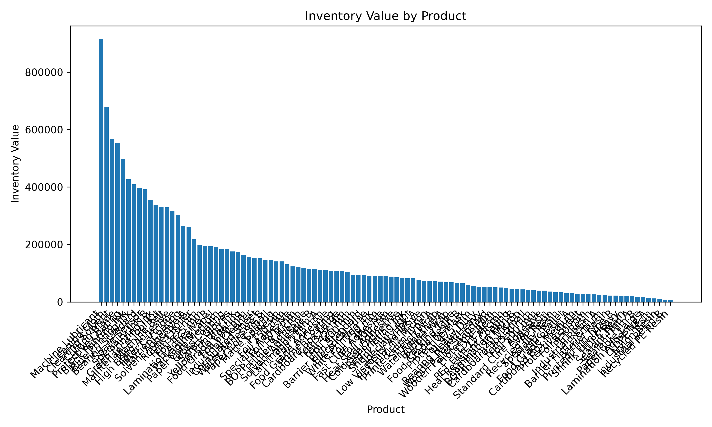
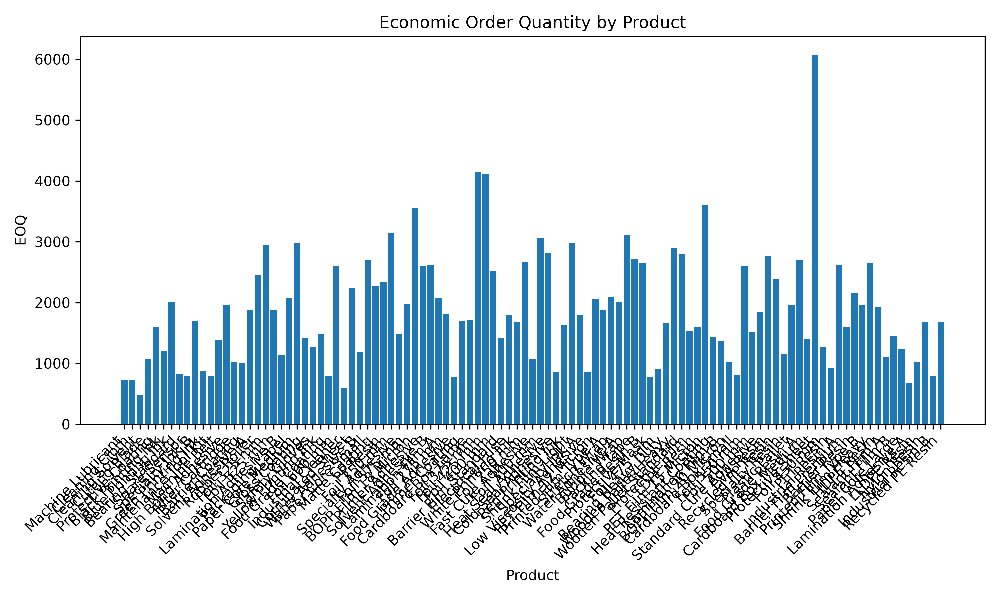
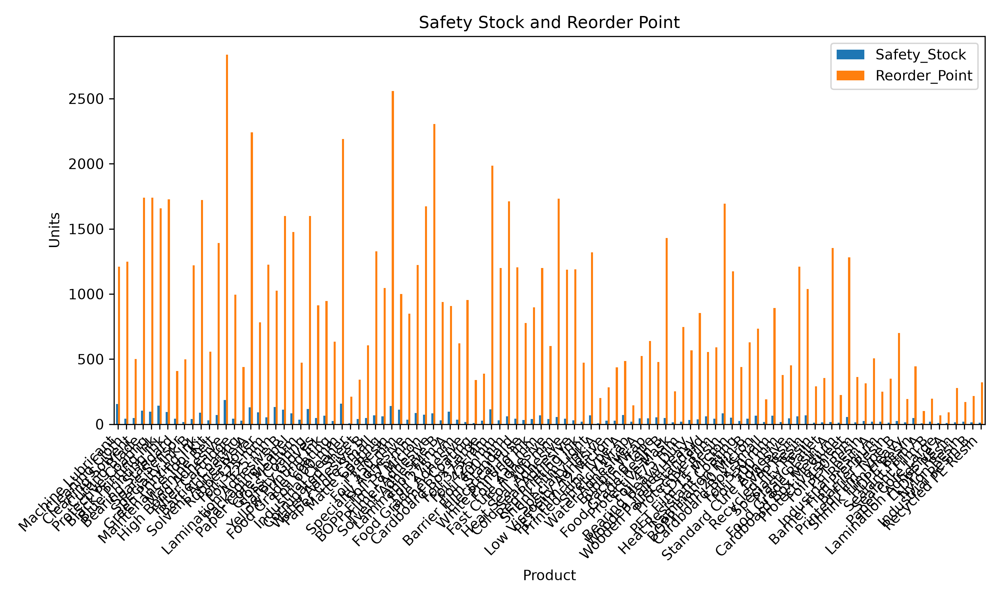
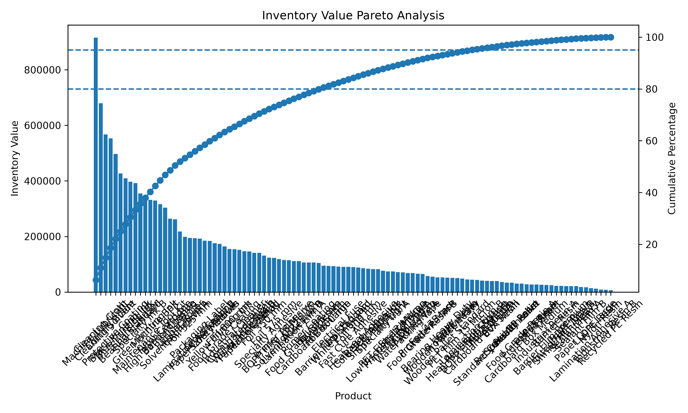

# Inventory Optimization Using Python

A Python-based supply chain analytics project that performs inventory classification, calculates key planning metrics, generates visualizations, and exports a formatted Excel report.

## Project Overview

This project analyzes a simulated inventory dataset containing 105 SKUs across multiple raw material and packaging categories.

The program supports inventory-planning decisions by calculating:

- Inventory Value
- ABC Classification
- Economic Order Quantity
- Safety Stock
- Reorder Point
- Cumulative Inventory Value Percentage

It also generates charts and exports the results into a professionally formatted Excel report.

## Business Problem

Inventory planners must balance product availability with the cost of holding excess inventory.

This project addresses several common inventory-management questions:

- Which SKUs account for the largest share of inventory value?
- What is the optimal order quantity?
- How much safety stock should be maintained?
- At what inventory level should replenishment be triggered?
- Which products require the closest management attention?

## Features

- Reads inventory data from a CSV file
- Calculates annual inventory value
- Performs ABC inventory classification
- Calculates Economic Order Quantity
- Calculates Safety Stock
- Calculates Reorder Point
- Generates four inventory visualizations
- Exports a professionally formatted Excel report
- Generates a simulated 105-SKU dataset

## Technologies Used

- Python
- Pandas
- Matplotlib
- OpenPyXL
- Microsoft Excel
- Visual Studio Code
- Git
- GitHub

## Inventory Calculations

### Inventory Value

```text
Inventory Value = Annual Demand × Unit Cost
```

### Economic Order Quantity

```text
EOQ = √((2 × Annual Demand × Ordering Cost) / Holding Cost)
```

### Safety Stock

```text
Safety Stock =
Service Level Z × Daily Demand Standard Deviation × √Lead Time
```

### Reorder Point

```text
Reorder Point =
Average Daily Demand × Lead Time + Safety Stock
```

## ABC Classification

Products are sorted by inventory value and assigned to categories based on cumulative inventory value:

- A Class: Approximately the first 80% of inventory value
- B Class: Approximately the next 15% of inventory value
- C Class: Approximately the remaining 5% of inventory value

## Visualizations

### Inventory Value by Product



### Economic Order Quantity



### Safety Stock and Reorder Point



### Pareto Analysis



## Project Structure

```text
inventory-optimization-python/
│
├── charts/
│   ├── eoq_chart.png
│   ├── inventory_value.png
│   ├── pareto_chart.png
│   └── safety_stock_reorder_point.png
│
├── generate_inventory_data.py
├── inventory_analysis.py
├── inventory_data.csv
├── inventory_report.xlsx
├── read_inventory.py
├── requirements.txt
├── README.md
├── LICENSE
├── .gitignore
└── .gitattributes
```

## How to Run the Project

### 1. Clone the repository

```bash
git clone https://github.com/msa272/inventory-optimization-python.git
```

### 2. Open the project folder

```bash
cd inventory-optimization-python
```

### 3. Install the required packages

```bash
pip install -r requirements.txt
```

### 4. Generate the sample dataset

```bash
python generate_inventory_data.py
```

### 5. Run the inventory analysis

```bash
python read_inventory.py
```

## Output

Running the project generates:

- A terminal summary containing inventory metrics
- A professionally formatted Excel report named `inventory_report.xlsx`
- Four charts inside the `charts` folder:
  - Inventory Value
  - Economic Order Quantity
  - Safety Stock and Reorder Point
  - Pareto Analysis

## Dataset

The project uses a simulated dataset of 105 inventory SKUs across multiple supply chain categories, including:

- Aluminium Foil
- Packaging Film
- Polymer Resin
- Adhesives
- Packaging Materials
- Ink and Coating
- Maintenance Supplies

The dataset is generated automatically using `generate_inventory_data.py` for educational and portfolio purposes. It does not contain confidential company data.

## Skills Demonstrated

- Supply Chain Analytics
- Inventory Planning
- ABC Analysis
- Economic Order Quantity
- Safety Stock Calculation
- Reorder Point Analysis
- Data Visualization
- Excel Report Automation
- Python Programming
- Pandas
- Matplotlib
- OpenPyXL
- Git and GitHub

## Future Improvements

Potential enhancements include:

- Demand Forecasting
- Inventory Turnover Analysis
- Slow-Moving and Dead-Stock Identification
- Lead-Time Variability
- SQL Database Integration
- Power BI Dashboard
- Interactive Streamlit Web Application

## Author

**Maanit Arora**

Rutgers Business School  
B.S. Business Analytics & Information Technology  
B.S. Supply Chain Management